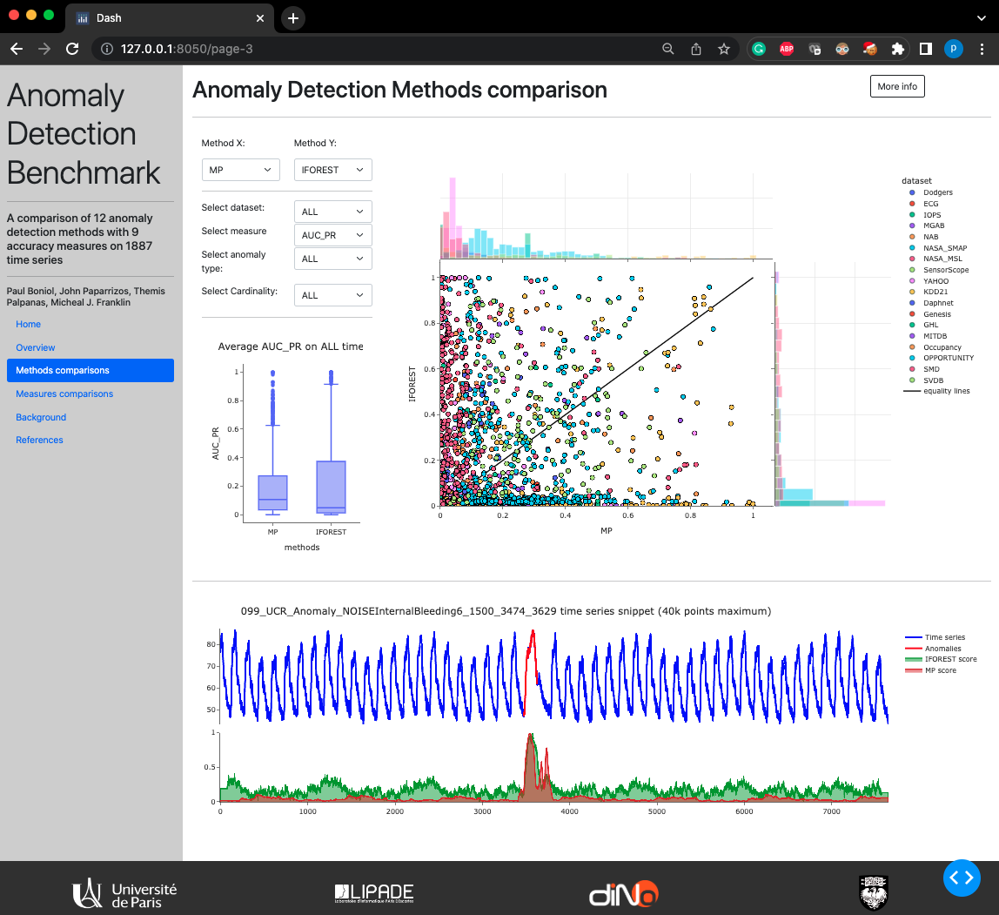

<h1 align="center">Theseus</h1>
<h2 align="center">Navigating the Labyrinth of Time Series Anomaly Detection</h2>

<div align="center">
<p>
 
</p>
</div>


The detection of anomalies in time series has gained ample academic and industrial attention, yet, no comprehensive benchmark exists to evaluate time-series anomaly detection methods. Therefore, there is no final verdict on which method performs the best (and under what conditions). Consequently, we often observe methods performing exceptionally well on one dataset but surprisingly poorly on another, creating an illusion of progress. To address these issues, we thoroughly studied over one hundred papers and summarized our effort in TSB-UAD, a new benchmark to evaluate univariate time series anomaly detection methods. In this repo, we provide Theseus, a modular and extensible web application that helps users navigate through the benchmark, and reason about the merits and drawbacks of both anomaly detection methods and accuracy measures under different conditions. Overall, our system enables users to compare 12 anomaly detection methods on 1980 time series, using 13 accuracy measures, and decide on the most suitable method and measure for some applications.

<p align="center">

</p>


If you use Theseus in your project or research, cite the following two papers:

* [VLDB 2022a](https://www.paparrizos.org/papers/PaparrizosVLDB22a.pdf)
* [VLDB 2022b](https://www.paparrizos.org/papers/PaparrizosVLDB22b.pdf)
* [VLDB 2022c](https://www.paparrizos.org/papers/BoniolVLDB22.pdf)

### References

> "TSB-UAD: An End-to-End Benchmark Suite for Univariate Time-Series Anomaly Detection"<br/>
> John Paparrizos, Yuhao Kang, Paul Boniol, Ruey Tsay, Themis Palpanas, and Michael Franklin.<br/>
> Proceedings of the VLDB Endowment (**PVLDB 2022**) Journal, Volume 15, pages 1697–1711<br/>

```bibtex
@article{paparrizos2022tsb,
  title={Tsb-uad: an end-to-end benchmark suite for univariate time-series anomaly detection},
  author={Paparrizos, John and Kang, Yuhao and Boniol, Paul and Tsay, Ruey S and Palpanas, Themis and Franklin, Michael J},
  journal={Proceedings of the VLDB Endowment},
  volume={15},
  number={8},
  pages={1697--1711},
  year={2022},
  publisher={VLDB Endowment}
}
```

> "Volume Under the Surface: A New Accuracy Evaluation Measure for Time-Series Anomaly Detection"<br/>
> John Paparrizos, Paul Boniol, Themis Palpanas, Ruey Tsay, Aaron Elmore, and Michael Franklin<br/>
> Proceedings of the VLDB Endowment (**PVLDB 2022**) Journal, Volume 15, pages 2774‑2787<br/>

```bibtex
@article{paparrizos2022volume,
  title={{Volume Under the Surface: A New Accuracy Evaluation Measure for Time-Series Anomaly Detection}},
  author={Paparrizos, John and Boniol, Paul and Palpanas, Themis and Tsay, Ruey S and Elmore, Aaron and Franklin, Michael J},
  journal={Proceedings of the VLDB Endowment},
  volume={15},
  number={11},
  pages={2774--2787},
  year={2022},
  publisher={VLDB Endowment}
}
```

> "Theseus: Navigating the Labyrinth of Time-Series Anomaly Detection"<br/>
> Paul Boniol, John Paparrizos, Yuhao Kang, Themis Palpanas, Ruey Tsay, Aaron Elmore, and Michael Franklin<br/>
> Proceedings of the VLDB Endowment (**PVLDB 2022**) Journal, Volume 15, pages 2774‑2787<br/>

```bibtex
@article{DBLP:journals/pvldb/BoniolPKPTEF22,
  author    = {Paul Boniol and
               John Paparrizos and
               Yuhao Kang and
               Themis Palpanas and
               Ruey S. Tsay and
               Aaron J. Elmore and
               Michael J. Franklin},
  title     = {Theseus: Navigating the Labyrinth of Time-Series Anomaly Detection},
  journal={Proceedings of the VLDB Endowment},
  volume    = {15},
  number    = {12},
  pages     = {3702--3705},
  year      = {2022},
  publisher={VLDB Endowment}
}
```

## Contributors

* Paul Boniol (Université Paris Cité)
* John Paparrizos (University of Chicago)


## Installation

The following tools are required to use Theseus:

- git
- conda (anaconda or miniconda)

#### Steps

1. First, due to limitations in the upload size on GitHub, we host the entire datasets at a different location. This webapp is using only subset of the dataset (stored in data/). You may download the entire datasets using the following links:

- Public: https://www.thedatum.org/datasets/TSB-UAD-Public.zip


2. Clone this repository using git and change into its root directory.

```bash
git clone https://github.com/boniolp/Theseus.git
cd Theseus/
```

3. Create and activate a conda-environment 'TSB'.

```bash
conda env create --file environment.yml
conda activate theseus
```
   
4. Install the dependencies from `requirements.txt`:
```
pip install -r requirements.txt
```

## In practice How to use the app
Run this app locally by:
```
python app.py
```
Open http://127.0.0.1:8050/ in your browser.
